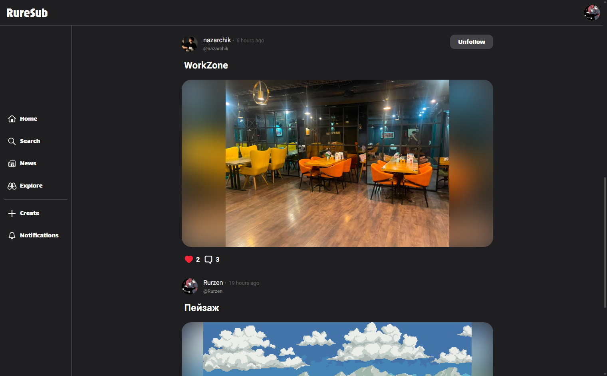
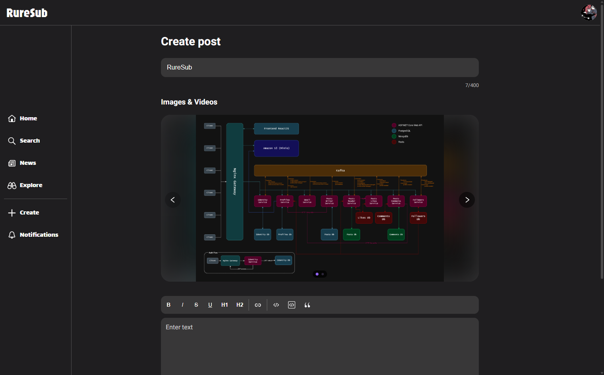
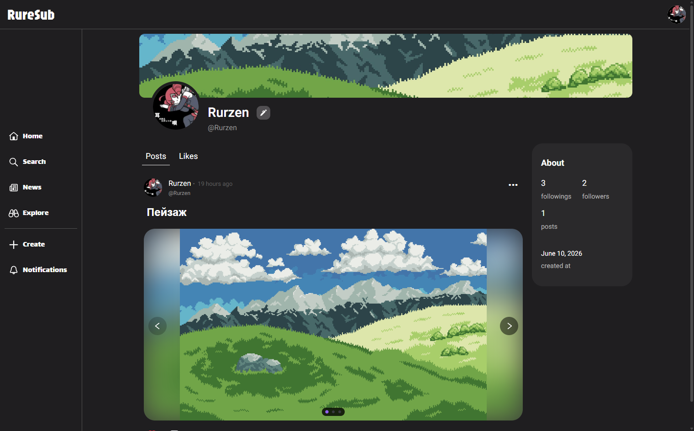
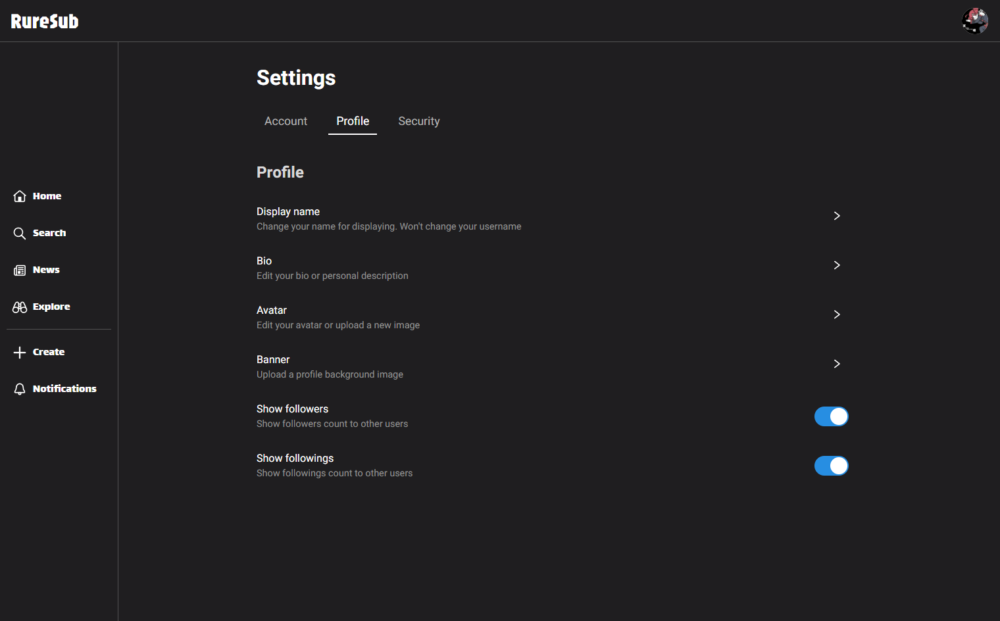

# RureSub

**RureSub** - Высоконагруженная социальная сеть на микросервисной архитектуре с использованием многих современных технологий.
Социальная сеть была разработана и дорабатывается в качестве пет проекта для демонстрации навыков в программировании и построении высоконагруженных архитектур.

На данный момент RureSub имеет базовый функционал для социальных сетей.

## Ссылки

[**Перейти к сайту**](https://prudently-pseudoofficial-josefina.ngrok-free.dev)

## Стек технологий

**Backend**

**Frontend**

**Databases**

**Other**

## Архитектурная диаграмма

| Микросервис  | Технологии | Назначение | Базы данных | Ссылка на репозиторий |
| ------------- | ------------- | ------------- | ------------- | ------------- |
| Frontend  | ReactJS | Страницы сайта | Нет | Нет |
| MinIO | MinIO | Хранение медиа файлов сайта | Нет | Нет |
| Kafka  | Kafka | Брокер сообщений между сервисами | Нет | Нет |
| Identity  | ASP.NET | Авторизация пользователей, создание аккаунтов,  выдача и хранение JWT токенов | PostgreSQL | [Перейти](https://github.com/ruslanovchy/RureSubIdentity) |
| Profiles  | ASP.NET | Профили пользователей, display name, аватары,  баннеры и прочие настройки | PostgreSQL | [Перейти](https://github.com/ruslanovchy/RureSubProfiles) |
| Email  | ASP.NET | Отправка сообщений по электронной почте | Нет | [Перейти](https://github.com/ruslanovchy/RureSubEmail) |
| Posts Writer  | ASP.NET | Публикация постов и источник истины | PostgreSQL | [Перейти](https://github.com/ruslanovchy/RureSubPostsWriter) |
| Posts Reader  | ASP.NET | Чтение, быстрая отдача и кэширование постов | MongoDb, Redis | [Перейти](https://github.com/ruslanovchy/RureSubPostsReader) |
| Posts Likes  | ASP.NET | Лайки постов, хранение кто какие посты лайкнул | Redis | [Перейти](https://github.com/ruslanovchy/RureSubPostsLikes) |
| Posts Comments  | ASP.NET | Комментарии постов, хранение кто на какие  посты оставил комментарий | MongoDb, Redis | [Перейти](https://github.com/ruslanovchy/RureSubPostsComments) |
| Followers | ASP.NET | Подписки пользователей, хранение кто на кого подписан | PostgreSQL, Redis | [Перейти](https://github.com/ruslanovchy/RureSubFollowers) |

## Архитектурные паттерны

**Коммуникация**

Сервисы общаются между собой через **Kafka** асинхронно. Для некоторых случаев используется **HTTP** запросы между сервисами. Один из таких случаев в **Posts Writer**. Когда создается новый пост, **Posts Writer** делает запрос на **Profiles** для получения данных профиля автора, сохраняет в свою базу данных и отправляет в **Kafka**. **Posts Reader** же обрабатывает сообщения и сохраняет всю информацию о посте включая имя автора, аватар автора и т. д. в **MongoDb** денормализованно.

**CQRS**

Публикация и чтение постов происходят в разных сервисах. Нагрузка на сервис чтения постов намного выше нагрузки на сервис публикаций, поэтому разумным решением было разделить эти операции на два независимых сервиса.

**Transactional Outbox/Inbox**

Для гарантированной отправки сообщений в Kafka во всех сервисах используется шаблон Transactional Outbox. Также для идемпотентности сообщений используется шаблон Transactional Inbox.

## Frontend

Сайт выполнен в минималистичном стиле. Дизайн вдохновлён Reddit, Instagram и TikTok. Сайт динамичный, с анимациями. Использовал библиотеки для большей динамичности, такие как Swiper для медиа файлов постов. Тексты постов могут быть стилизированными с стандартными возможностями Markdown. 

## Скриншоты страниц

**Главная страница**

**Страница создания поста**

**Профиль пользователя**

**Настройки**

## Как запустить

В репозитории есть папка **compose**, в котором находится все необходимое для запуска **docker compose**. Перед запуском убедитесь что у вас на устройстве установлен **[docker](https://www.docker.com/)**. Также требуется ввести некоторые переменные окружения в файле **.env**, такие как **JWT_KEY**, **EMAIL_ADDRESS**, **EMAIL_PASSWORD**. 

Для того чтобы запустить приложение нужно скачать папку compose или репозиторий, затем открыть терминал, перейти к папке **compose** и ввести команду **docker compose up**. Для некоторых операционных систем требуются разрешения на чтение файлов из папок **postgres-init-scripts** и **mongo-init-scripts**. 
